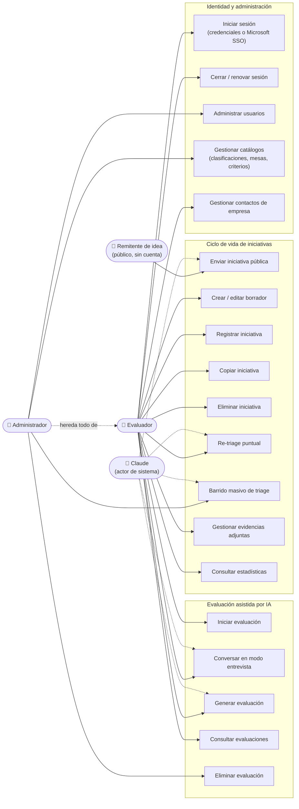
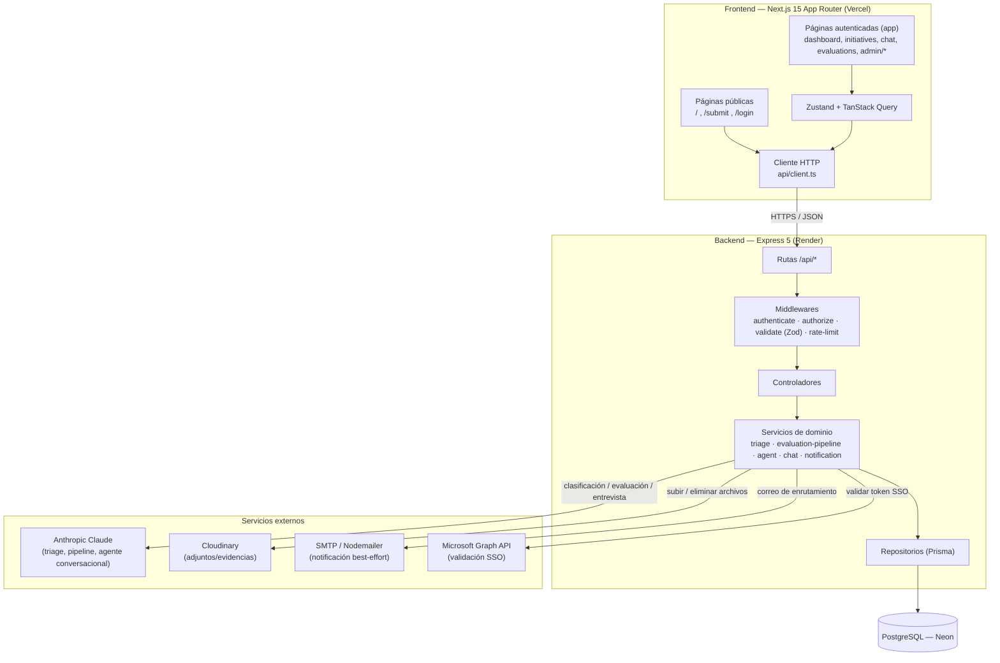
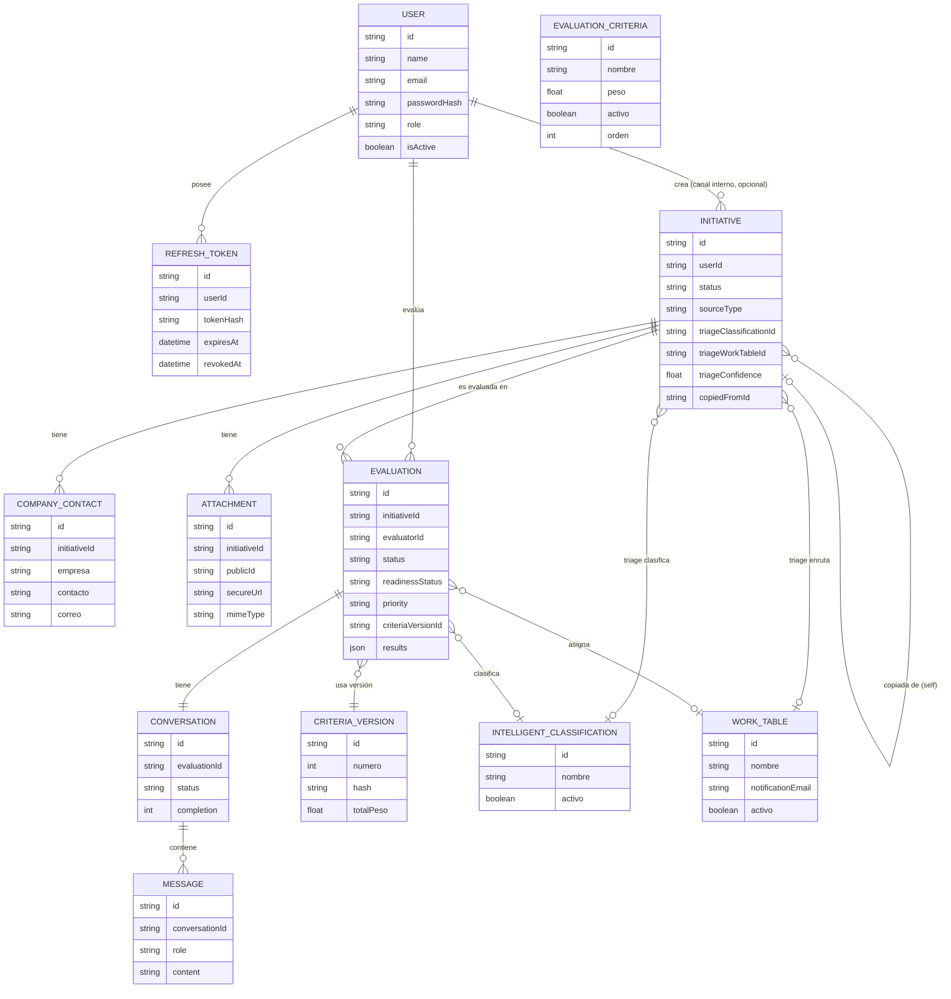

# Arquitectura AS-IS — LabLens

**Fecha:** 2026-08-13
**Documento maestro** que consolida el trabajo de ingeniería de requisitos realizado sobre el repositorio LabLens. Es autocontenido: incorpora íntegramente el contenido de los documentos individuales previamente producidos (`docs/inventario-tecnico.md`, `docs/actores-sistema.md`, `docs/casos-de-uso.md`, `docs/requisitos-funcionales.md`, `docs/requisitos-no-funcionales.md`, `docs/diagramas-apoyo.md`), reorganizado en una estructura única.

---

## 1. Introducción y alcance

**LabLens** es un prototipo de recolección de ideas de innovación mediante un formulario público y un clasificador con inteligencia artificial, construido como monorepo de dos proyectos independientes: `backend/` (API en Express + Prisma + PostgreSQL) y `frontend/` (interfaz en Next.js 15).

El flujo de negocio central es: cualquier persona envía una idea a través de un formulario público → el sistema la clasifica automáticamente con IA (determinando si es del alcance del Laboratorio Digital o debe enrutarse a otra área) → si queda en el Lab, un evaluador la analiza mediante una entrevista conversacional asistida por IA → el sistema genera de forma determinística una evaluación completa (puntuación, clasificación, prioridad y caso de negocio).

**Este documento describe el estado *AS-IS*: lo que el código hace hoy**, verificado directamente contra controladores, servicios, validadores, repositorios y formularios reales (con cita de archivo cuando aporta precisión) — no contra documentación previa que pudiera estar desactualizada. Cuando algo existe solo como diseño futuro y no como código (por ejemplo, el roadmap de migración a AWS con Bedrock/DynamoDB/Lambda documentado en materiales de arquitectura anteriores del proyecto), se marca explícitamente como *planeado, no implementado* y queda fuera del alcance de "lo que el sistema hace hoy".

**Estructura de este documento:** actores → casos de uso → requisitos funcionales → requisitos no funcionales → arquitectura técnica → modelo de datos → limitaciones y deuda técnica. Cada sección es puede leerse de forma independiente, pero juntas forman la línea base completa para cualquier ejercicio de diseño TO-BE.

---

## 2. Actores del sistema

### 2.1 Actores primarios

Personas que inician acciones directamente sobre el sistema.

| Actor | Autenticación | Qué hace |
|---|---|---|
| **Remitente de idea** | Ninguna (público) | Envía una iniciativa vía `/submit` → `POST /api/public/initiatives`. Tres variantes según `sourceType`: colaborador interno, contratista/proveedor externo, referente internacional. No tiene cuenta ni acceso al back-office; nunca vuelve a interactuar con el sistema tras el envío. |
| **Evaluador** (rol `EVALUATOR`) | Login (email/password o Microsoft SSO) | Revisa y edita iniciativas propias, ejecuta triage puntual, inicia y conduce evaluaciones (chat con el agente IA), consulta catálogos (solo lectura). No puede gestionar usuarios ni catálogos. |
| **Administrador** (rol `ADMIN`) | Login (email/password o Microsoft SSO) | Superset del evaluador: además gestiona usuarios (crear, cambiar rol, activar/desactivar, eliminar), criterios de evaluación (con pesos y versionado), clasificaciones inteligentes y mesas de trabajo, y ejecuta `triage-sweep` (reclasificación en lote). Es el único rol que puede eliminar evaluaciones. |

El sistema solo reconoce dos roles de cuenta (`EVALUATOR`, `ADMIN`). No existe autorregistro: todo usuario lo crea un administrador. `CompanyContact` (contacto de una empresa externa interesada) es un **dato**, no un actor — nunca inicia sesión.

### 2.2 Actores secundarios

Sistemas externos que LabLens consume para funcionar.

| Sistema | Rol que cumple | Dónde se invoca | Variable(s) de entorno |
|---|---|---|---|
| **Anthropic Claude** (API LLM) | Motor de triage automático, pipeline de evaluación (scoring, clasificación, prioridad, business case), y agente conversacional con tool-use en el "Modo Entrevista" | `backend/src/services/llm.service.ts`, `agent.service.ts`, `triage.service.ts`, `evaluation-pipeline.service.ts` | `ANTHROPIC_API_KEY`, `ANTHROPIC_MODEL` |
| **Cloudinary** | Almacenamiento de adjuntos/evidencias | `backend/src/services/cloudinary.service.ts` | `CLOUDINARY_CLOUD_NAME`, `CLOUDINARY_API_KEY`, `CLOUDINARY_API_SECRET`, `CLOUDINARY_FOLDER` |
| **Servidor SMTP** (vía Nodemailer) | Notificación por correo a la mesa de trabajo cuando una iniciativa se enruta fuera del Lab | `backend/src/services/notification.service.ts` | `SMTP_HOST`, `SMTP_PORT`, `SMTP_USER`, `SMTP_PASS`, `SMTP_FROM` — si no están configuradas, el envío se omite silenciosamente |
| **Microsoft Graph API / Azure AD (MSAL)** | Validación de identidad para el login corporativo SSO | `frontend/src/config/msal.ts`, `backend/src/services/auth.service.ts` | `NEXT_PUBLIC_MSAL_CLIENT_ID`, `NEXT_PUBLIC_MSAL_TENANT_ID` |
| **Neon (PostgreSQL)** | Motor de base de datos subyacente | `backend/prisma/schema.prisma` | `DATABASE_URL` |

Sin integraciones de pagos, analytics/monitoring externo (APM), ni otros proveedores de LLM.

### 2.3 Actores "silenciosos" / procesos automáticos

**Hallazgo verificado:** se buscó en todo `backend/` cualquier librería de scheduling (`node-cron`, `node-schedule`, `bull`/`bullmq`, `agenda`, `setInterval`, `CronJob`) y **no se encontró ninguna**. Toda la automatización actual es reactiva a una petición HTTP concreta, nunca disparada por reloj.

| Proceso | Qué lo dispara | Naturaleza |
|---|---|---|
| **Triage automático** | Cada envío público y cada registro interno | Automático, pero disparado por evento HTTP — no es background/cron |
| **Notificación por correo a la mesa de trabajo** | Efecto colateral del triage cuando enruta fuera del Lab | El más cercano a "silencioso"; diseñado best-effort |
| **`triage-sweep`** (reclasificación en lote) | Un ADMIN lo dispara manualmente | Automático en su ejecución, pero no es un cron |
| **Seed y migraciones de base de datos** | Proceso de despliegue (Render) | Automatización de infraestructura, no un actor en operación normal |

**Conclusión:** el proceso más parecido a un actor autónomo es el propio motor de triage IA, pero siempre en respuesta a una acción humana previa, nunca por su cuenta.

---

## 3. Casos de uso (catálogo + diagrama)

### 3.1 Diagrama de casos de uso

### 3.2 Catálogo detallado de casos de uso

Cada caso de uso corresponde a un endpoint real del backend, verificado leyendo controladores, servicios, validadores y repositorios completos. Roles del sistema: `EVALUATOR` y `ADMIN`. "Público" significa sin autenticación.

#### Sección A — Identidad y administración

**A.1 Iniciar sesión con credenciales** (`POST /api/auth/login`, público)
- *Flujo principal:* valida email/password → normaliza y exige dominio `@achcolombia.com.co` → busca usuario, compara password con bcrypt → si es válido, firma access token y emite refresh token (hasheado SHA-256, persistido), setea cookie httpOnly.
- *Excepciones:* dominio no permitido → 403; usuario inexistente o password incorrecta → 401 "Invalid credentials" (mismo mensaje en ambos casos); cuenta inactiva → 403.
- *Precondiciones:* ninguna. *Postcondiciones:* nueva fila `RefreshToken`; cookie seteada; access token devuelto.

**A.2 Iniciar sesión con Microsoft (SSO)** (`POST /api/auth/microsoft`, público)
- *Flujo:* recibe token de Microsoft → valida contra Graph API → extrae email, exige dominio corporativo → busca el usuario (**no lo crea si no existe**) → si existe y activo, misma creación de sesión que el login normal.
- *Excepciones:* token inválido/expirado → 401; sin email en el perfil → 400; dominio no permitido → 403; usuario no registrado → 401 (login con Microsoft nunca da de alta cuentas); cuenta inactiva → 403.
- *Precondiciones:* usuario debe existir previamente, creado por un admin.

**A.3 Cerrar sesión** (`POST /api/auth/logout`, público) — revoca el refresh token si existe y borra la cookie; nunca falla por falta de sesión.

**A.4 Renovar sesión** (`POST /api/auth/refresh`, público, autenticado por cookie) — verifica el refresh token, lo **rota** (revoca el actual, emite uno nuevo), emite nuevo access token. Excepciones: sin cookie, JWT inválido, token revocado/de otro usuario, o usuario borrado → 401 en todos los casos.

**A.5 Obtener perfil actual** (`GET /api/auth/me`) — valida el access token y devuelve el perfil. Excepciones: sin token/token inválido → 401; usuario borrado → 404.

**A.6 Administrar usuarios** (patrón CRUD + reglas) — `/api/users`, todo el router requiere ADMIN.
| Operación | Detalle |
|---|---|
| Listar / Crear / Obtener / Actualizar | Sin filtros ni paginación; email único y dominio corporativo obligatorios; password hasheado con bcrypt. |
| Cambiar rol | **Regla:** un admin no puede autodegradarse. |
| Actualizar (autoedición) | **Regla:** no puede autodesactivarse. |
| Resetear contraseña | **Es un placeholder**: valida que el usuario exista pero no modifica nada ni envía correos. |
| Eliminar | **Regla:** no puede eliminarse a sí mismo. Hard delete. |

**A.7 Gestionar catálogos: clasificaciones y mesas de trabajo** (patrón CRUD) — lectura para cualquier autenticado; escritura solo ADMIN. Mesas de trabajo incluyen `notificationEmail`.

**A.8 Gestionar criterios de evaluación** (con reglas especiales) — `/api/evaluation-criteria`.
- **Regla central:** la suma de pesos de los criterios *activos* debe ser exactamente 100% (tolerancia `1e-6`), validada al crear/actualizar/eliminar/reordenar.
- No se puede eliminar un criterio activo si rompe la suma de 100%.
- Cada mutación exitosa dispara un versionado automático: hash SHA-256 del conjunto de criterios activos → nueva `CriteriaVersion` si esa combinación nunca existió (idempotente).
- Reordenar (`PUT /reorder`) es una transacción atómica sobre el estado completo enviado por el cliente.
- `GET /versions` permite auditar con qué configuración exacta se evaluó cada iniciativa.

**A.9 Gestionar contactos de empresa** — requiere acceso a la iniciativa (propietario o rol EVALUATOR/ADMIN); iniciativa inaccesible → 404 (nunca 403, oculta existencia).

#### Sección B — Ciclo de vida de las iniciativas

**Máquina de estados real:** `DRAFT → REGISTERED → TRIAGED_LAB | TRIAGED_EXTERNAL | UNDER_REVIEW`. `DRAFT` es el único estado editable; no hay transiciones hacia atrás; una iniciativa triada se copia (no se edita) para modificarla. Los estados `EVALUATED`/`APPROVED`/`REJECTED`/`ARCHIVED` pertenecen al pipeline de evaluación (Sección C).

**B.1 Enviar iniciativa pública** (`POST /api/public/initiatives`, público)
- *Flujo:* rate limit por IP (1h) → procesa hasta 10 archivos/15MB con Multer si es multipart → valida los 12 campos (Zod) → crea la iniciativa directo en `REGISTERED` (nunca pasa por `DRAFT`) → sube adjuntos a Cloudinary → dispara el triage automático en `try/catch` (un fallo no bloquea la respuesta).
- *Excepciones:* rate limit excedido; `payload` mal formado → 400; validación fallida → 400; MIME no permitido → 400 (ocurre **después** de crear la iniciativa, sin rollback); archivo excede límites → error Multer sin manejo dedicado; fallo de Cloudinary → 502; fallo del triage → absorbido.
- *Postcondiciones:* iniciativa creada (`REGISTERED` mínimo, clasificada si el triage tuvo éxito).

**B.2 Listar / B.3 Obtener iniciativa** — solo lectura; EVALUATOR/ADMIN ven todas, cualquier otro caso queda restringido a propias; no encontrada o sin acceso → 404 en ambos casos (mismo mensaje deliberadamente).

**B.4 Crear borrador** (`POST /api/initiatives`, EVALUATOR/ADMIN) — todos los campos opcionales (autoguardado); `status: DRAFT` forzado.

**B.5 Actualizar borrador** (`PATCH /api/initiatives/:id`) — solo permitido en `DRAFT`; el `status` del body se ignora siempre. *Excepción:* no `DRAFT` → 409 "ya fue clasificada... sácale una copia".
> **Observación de código:** este endpoint usa un chequeo de acceso `role===ADMIN` estricto, distinto del chequeo más amplio (`canViewAll`, incluye EVALUATOR) que usan otros métodos del mismo servicio — inconsistencia real detectada, no documentada como intencional.

**B.6 Registrar iniciativa** (`POST /:id/register`) — exige `DRAFT`, todos los campos obligatorios completos y **al menos un adjunto** (400 si no hay ninguno); pasa a `REGISTERED` y dispara triage (fallo no revierte el registro). La respuesta HTTP no refleja el resultado final del triage.

**B.7 Eliminar iniciativa** — ADMIN sin restricción; EVALUATOR solo sus propios borradores (409 si no es `DRAFT`).

**B.8 Copiar iniciativa** — nace en `DRAFT`, descarta triage/estado previos, conserva `copiedFromId`; **los adjuntos reutilizan el mismo archivo de Cloudinary** (no se re-sube, solo se crea una nueva fila `Attachment`).

**B.9 Re-triage puntual** (`POST /:id/triage`) — exige no estar en `DRAFT`; a diferencia del triage automático, **no absorbe errores del LLM** (se propagan al cliente).

**B.10 Barrido masivo de triage** (`POST /triage-sweep`, solo ADMIN) — `alcance: pendientes|todas`; procesamiento **secuencial deliberado** (para no saturar rate limit del LLM); fallos individuales no abortan el barrido.

**B.11 Motor de triage con IA** (lógica común a B.1, B.6, B.9, B.10):
1. Carga catálogos activos (409 si faltan clasificaciones o mesas).
2. Prompt a Claude con el catálogo + contexto de la iniciativa (sin id/status).
3. Decisión de enrutamiento en orden: no clasificable → `UNDER_REVIEW`; id de catálogo inválido devuelto por el modelo → `UNDER_REVIEW` (diseño deliberado, ya no rompe); confianza < 0.4 → `UNDER_REVIEW`; en otro caso, clasificado → `TRIAGED_LAB` (innovación disruptiva/adyacente) o `TRIAGED_EXTERNAL` (cualquier otra).
4. Si `TRIAGED_EXTERNAL`, dispara notificación por correo (best-effort).

| Causa de fallo | Efecto |
|---|---|
| Iniciativa no existe | 404 |
| Sin clasificaciones/mesas activas | 409 |
| Falla la llamada a Claude / rechazo / respuesta vacía | 502 |
| JSON no parseable | 502 |
| JSON no cumple el esquema | Sin envolver → 400 (inconsistencia respecto a los demás fallos del LLM) |
| Falla el envío de correo | Absorbido, `notificationSent:false` |

**B.12 Estadísticas** (`GET /stats`, EVALUATOR/ADMIN) — conteos, comparativa 30 días, agrupaciones, timeline.

**B.13 Listar evaluaciones de una iniciativa** — reutiliza el chequeo de acceso de B.3.

**B.14 Notificación por correo a la mesa de trabajo** — disparada solo por `TRIAGED_EXTERNAL`; si falta `notificationEmail` o `SMTP_HOST`, se omite sin error; **diseño explícito: nunca lanza una excepción** ("a failed notification must not roll back a completed triage").

**B.15 Listar / B.16 Descargar (ZIP) / B.17 Subir / B.18 Eliminar adjuntos** — subir/eliminar solo permitido en `DRAFT`; MIME permitido: PDF/DOCX/XLSX/PNG/JPEG; al eliminar, se cuentan referencias compartidas por copias antes de destruir el archivo remoto (best-effort, la fila en BD se borra siempre); al descargar el ZIP, un archivo individual que falle se **omite silenciosamente** sin avisar.

> **Observaciones abiertas de la Sección B:** (1) chequeos de acceso inconsistentes entre métodos del mismo servicio (ADMIN-only vs. canViewAll); (2) sin manejo dedicado de errores de Multer; (3) borrado de iniciativa sin limpieza explícita de Cloudinary en el propio flujo (depende de cascada de BD).

#### Sección C — Evaluación asistida por IA

**C.1 Iniciar evaluación** (`POST /initiatives/:id/evaluations`) — bloquea si `ARCHIVED` (409) o sin criterios activos (409); crea `Evaluation` (`IN_PROGRESS`) + `Conversation` (`COLLECTING_INFORMATION`) en transacción; `Initiative → UNDER_REVIEW`. Modo `interview` (default): lanza el agente con mensaje de apertura. Modo `direct`: ejecuta el pipeline de inmediato sin transcript.
> **Observación:** este endpoint pasa `isAdmin: true` siempre, desactivando en la práctica la restricción de propiedad — cualquier EVALUATOR puede iniciar evaluación sobre cualquier iniciativa.

**C.2 Listar/ver conversaciones** — EVALUATOR ve solo las propias; conversación ajena o sin evaluación asociada → 404 (oculta existencia).

**C.3 Enviar mensaje en Modo Entrevista** (`POST /conversations/:id/messages`) — bloqueado si `Evaluation.status === COMPLETED` (409). El agente usa hasta 8 rondas de herramientas:

| Herramienta | Qué hace |
|---|---|
| `searchKnowledge` | Base de conocimiento del Lab (MVP: archivos `.md` estáticos, sin RAG real) |
| `searchSimilarInitiatives` | Similitud textual con iniciativas previas (no embeddings) |
| `getInitiative` | Datos completos de la iniciativa en evaluación |
| `getEvaluationCriteria` | Criterios activos con peso |
| `getPreviousEvaluations` | Evaluaciones previas completadas, como contexto histórico |
| `updateReadiness` | Señaliza disposición para evaluar (7 indicadores); no genera la evaluación |

Existen herramientas de código no registradas (`calculate-fit`, `generate-business-case`, `generate-executive-summary`, `get-catalogs`, `save-evaluation`) — código muerto respecto al flujo actual. Una herramienta individual que falla no rompe el turno (el modelo recibe el error y decide cómo continuar).

**C.4 Generar evaluación** (`POST /conversations/:id/generate`) — pipeline determinístico: scoring paralelo por criterio → clasificación → mesa → prioridad → business case → persistencia. **No exige `readinessStatus === READY`** (deliberado). Si ya está `COMPLETED`, responde 200 con el resultado existente (asimetría respecto a C.3, que da 409). Cálculo del **Fit** = promedio ponderado puro de `score × peso`. Se guardan snapshots inmutables de criterios/pesos/clasificación/mesa. Se compara con el triage inicial internamente, **sin mostrárselo al modelo**. Completa: `Evaluation → COMPLETED`, `Conversation → COMPLETED`, `Initiative → EVALUATED`.
> **Inconsistencia:** fallos de esquema (Zod) sobre respuestas del LLM en el pipeline dan 400; fallos de parseo JSON dan 502 — mismo tipo de problema (fallo del modelo), distinto tratamiento.

**C.5 Listar/ver/eliminar evaluaciones** — eliminar exige ADMIN estricto; **no valida el estado de la conversación antes de borrar**; la BD elimina en cascada `Conversation` + `Message`, sin afectar la `Initiative`.

---

## 4. Requisitos funcionales

*(RF-01 a RF-63, contenido íntegro de `docs/requisitos-funcionales.md`)*

### 4.1 Autenticación y sesión
- **RF-01:** Login con correo y contraseña, restringido a dominio `@achcolombia.com.co`.
- **RF-02:** Login corporativo vía Microsoft SSO, sin creación automática de cuentas.
- **RF-03:** Cierre de sesión con revocación del token de renovación.
- **RF-04:** Renovación de sesión mediante rotación del token (el anterior se invalida).
- **RF-05:** Consulta del propio perfil por parte de un usuario autenticado.

### 4.2 Administración de usuarios
- **RF-06:** Listar todos los usuarios (ADMIN).
- **RF-07:** Crear usuarios (nombre, correo corporativo único, contraseña, rol), sin autorregistro público.
- **RF-08:** Consultar el detalle de un usuario específico.
- **RF-09:** Actualizar datos, rol y estado (activo/inactivo) de un usuario.
- **RF-10:** Impedir que un administrador se autodegrade, autodesactive o autoelimine.
- **RF-11:** Eliminar una cuenta de usuario (excepto la propia).
- **RF-12:** Función de reseteo de contraseña. *(Parcialmente implementado: placeholder sin efecto real hoy).*

### 4.3 Catálogos de configuración
- **RF-13:** Consultar los catálogos de clasificaciones, mesas de trabajo y criterios (cualquier autenticado).
- **RF-14:** CRUD de clasificaciones inteligentes (ADMIN).
- **RF-15:** CRUD de mesas de trabajo, con correo de notificación (ADMIN).
- **RF-16:** CRUD de criterios de evaluación (nombre, descripción, contexto IA, peso).
- **RF-17:** Exigir que la suma de pesos de los criterios activos sea exactamente 100%.
- **RF-18:** Impedir eliminar un criterio activo si rompe la regla de suma al 100%.
- **RF-19:** Reordenar el conjunto completo de criterios en una operación atómica.
- **RF-20:** Versionar automáticamente la configuración de criterios ante cada cambio del conjunto activo.
- **RF-21:** Consultar el historial de versiones de criterios, con conteo de evaluaciones por versión.
- **RF-22:** Reutilizar una versión de criterios ya existente si la configuración es idéntica a una anterior.

### 4.4 Contactos de empresa
- **RF-23:** Registrar contactos de empresa asociados a una iniciativa.
- **RF-24:** Actualizar y eliminar contactos de empresa.
- **RF-25:** Exigir al menos un contacto cuando el formulario indica un interesado externo.

### 4.5 Envío público de iniciativas
- **RF-26:** Envío de iniciativas por formulario público de 12 preguntas, sin autenticación.
- **RF-27:** Distinción del origen: colaborador interno, contratista/proveedor externo, referente internacional.
- **RF-28:** Exigir al menos una selección en área impactada y producto/servicio relacionado.
- **RF-29:** Adjuntar evidencias (PDF/DOCX/XLSX/PNG/JPG), máximo 10 archivos / 15MB c/u.
- **RF-30:** Limitar los envíos públicos por IP/hora (antispam).
- **RF-31:** Clasificar automáticamente con IA cada iniciativa recién enviada, sin bloquear la confirmación si la clasificación falla.

### 4.6 Gestión y ciclo de vida interno de iniciativas
- **RF-32:** Crear un borrador desde el back-office, con guardado incremental.
- **RF-33:** Editar libremente una iniciativa mientras esté en borrador.
- **RF-34:** Impedir la edición de una iniciativa ya registrada/clasificada (debe copiarse).
- **RF-35:** Exigir formulario completo + al menos una evidencia para registrar.
- **RF-36:** Disparar la clasificación por IA automáticamente al registrar.
- **RF-37:** Copiar una iniciativa como nuevo borrador, preservando trazabilidad y reutilizando evidencias sin duplicar archivos.
- **RF-38:** Eliminar una iniciativa, restringiendo a un evaluador a sus propios borradores.
- **RF-39:** Listar/filtrar iniciativas por estado, origen, clasificación, mesa, fechas y texto.
- **RF-40:** Presentar estadísticas agregadas a evaluadores y administradores.

### 4.7 Clasificación automática con IA (triage)
- **RF-41:** Clasificar cada iniciativa con IA: clasificación, mesa, confianza y justificación.
- **RF-42:** Enviar a revisión manual cuando la IA no tenga confianza suficiente, el contenido no sea clasificable, o la propuesta esté fuera del catálogo activo.
- **RF-43:** Permitir reclasificación puntual de una iniciativa ya registrada.
- **RF-44:** Permitir reclasificación masiva (ADMIN), sin que un fallo individual detenga el proceso.
- **RF-45:** Distinguir alcance Lab vs. externo según la clasificación resultante.

### 4.8 Notificaciones
- **RF-46:** Notificar automáticamente por correo a la mesa de trabajo cuando una iniciativa se enrute fuera del Lab, sin que un fallo de envío revierta la clasificación.

### 4.9 Gestión de evidencias/adjuntos
- **RF-47:** Listar evidencias de una iniciativa.
- **RF-48:** Descargar todas las evidencias en un único archivo comprimido.
- **RF-49:** Adjuntar evidencias solo en estado borrador, validando tipo de archivo.
- **RF-50:** Eliminar una evidencia solo en estado borrador.

### 4.10 Evaluación asistida por IA
- **RF-51:** Iniciar evaluación de una iniciativa (entrevista o evaluación directa).
- **RF-52:** Impedir iniciar evaluación sobre una iniciativa archivada.
- **RF-53:** Conducir una entrevista conversacional con IA, una pregunta a la vez.
- **RF-54:** Permitir que el asistente consulte conocimiento del Lab, iniciativas similares, criterios vigentes y evaluaciones previas durante la entrevista.
- **RF-55:** Registrar y actualizar el nivel de disposición/completitud de la información, sin permitir juicios anticipados del asistente.
- **RF-56:** Impedir enviar mensajes en una conversación cuya evaluación ya fue completada.
- **RF-57:** Generar de forma determinística: puntuación por criterio, clasificación, mesa, prioridad y caso de negocio.
- **RF-58:** Calcular el ajuste (Fit) como promedio ponderado de las puntuaciones por criterio.
- **RF-59:** Conservar copia inmutable de criterios/pesos/clasificación/mesa usados; registrar internamente la comparación con el triage inicial sin exponerla al modelo.
- **RF-60:** Marcar la evaluación como completada e inmutable, actualizando la iniciativa a evaluada.
- **RF-61:** Consultar el historial de conversaciones y evaluaciones de una iniciativa.

### 4.11 Administración de evaluaciones
- **RF-62:** Un evaluador consulta solo sus evaluaciones; un administrador, todas.
- **RF-63:** Solo un administrador puede eliminar una evaluación (elimina en cascada conversación y mensajes, sin afectar la iniciativa).

---

## 5. Requisitos no funcionales

*(contenido íntegro de `docs/requisitos-no-funcionales.md`)*

### 5.1 Rendimiento
**Cumplido:** caché en memoria de la base de conocimiento IA; scoring de criterios en paralelo (`Promise.all`); límites de tamaño de body (1MB) y archivos (15MB/10).
**Limitaciones:** sin caché de consultas a BD; **sin paginación en ningún listado** (verificado: cero `skip`/`take`/`cursor` en repositorios) — degradación esperable con el crecimiento de datos; barrido de triage deliberadamente secuencial (throughput bajo por diseño); descarga de ZIP sin paralelismo.

### 5.2 Seguridad
**Cumplido:** contraseñas con bcrypt; JWT de acceso + refresh rotativo y revocable; refresh token hasheado (SHA-256), nunca en claro; cookies httpOnly con `secure` condicional; CORS con origen dinámico (nunca `*`); validación Zod en toda entrada; autorización por rol; login restringido a dominio corporativo; rate limiting en envío público.
**Limitaciones:** **sin cabeceras de seguridad HTTP** (sin helmet/CSP/HSTS, verificado); **sin rate limit en `/api/auth/login`** (expuesto a fuerza bruta); sin protección CSRF explícita; secretos en variables de entorno planas, sin vault/rotación; **reset de contraseña es un placeholder** sin vía real de autorecuperación; sin auditoría de accesos; HTTPS depende enteramente de la plataforma de hosting, no se fuerza en el código.

### 5.3 Escalabilidad
**Cumplido:** autenticación stateless vía JWT de acceso; base de datos serverless (Neon); arquitectura en capas desacopladas.
**Limitaciones:** monolito único (sin descomposición en servicios); **sin colas asíncronas** — las llamadas al LLM bloquean la petición HTTP; sin contenedores/orquestación; sin balanceo de carga ni múltiples instancias declaradas; el refresh token exige consulta a BD en cada renovación (componente con estado).

### 5.4 Disponibilidad
**Cumplido:** `GET /api/health`; middleware centralizado de errores; diseño best-effort explícito en notificación por correo y limpieza de Cloudinary.
**Limitaciones:** **sin reintentos/backoff** ante fallos transitorios de Anthropic/Cloudinary/SMTP (verificado); sin circuit breakers; **sin monitoreo/alertas** (sin winston/pino/Sentry/Datadog); el health check no verifica dependencias (BD, Anthropic, Cloudinary); sin redundancia de instancias documentada; adjuntos que fallan al descargar se omiten silenciosamente del ZIP.

### 5.5 Usabilidad
**Cumplido:** componentes accesibles por defecto (Radix UI vía shadcn/ui — foco, teclado, ARIA, confirmado en 26 archivos); diseño responsive (Tailwind mobile-first); modo oscuro; feedback visual (toasts, indicadores de carga/escritura).
**Limitaciones:** uso de breakpoints responsive limitado (63 ocurrencias en 34 archivos de todo el frontend); sin pruebas de accesibilidad automatizadas ni auditoría documentada; sin internacionalización (todo el texto fijo en español); **el middleware de autenticación del frontend es un placeholder explícito** (no valida sesión server-side — TODO propio en el código).

### 5.6 Mantenibilidad
**Cumplido:** TypeScript estricto en ambos proyectos; ESLint + Prettier; arquitectura en capas consistente; validación centralizada con Zod; documentación en README y `docs/`.
**Limitaciones:** **cero pruebas automatizadas en todo el repositorio** (verificado: sin Jest/Vitest/Playwright, sin script `test`, cero archivos `*.test.*`/`*.spec.*`); código muerto (herramientas de IA no registradas, heurística de Fit sin uso real); inconsistencias de manejo de errores ya documentadas (mismo tipo de fallo del LLM da distinto código HTTP según el paso del pipeline); **sin CI/CD** (sin `.github/workflows`).

### 5.7 Resumen de limitaciones para el TO-BE

| Categoría | Brecha principal | Riesgo si no se atiende |
|---|---|---|
| Rendimiento | Sin paginación en ningún listado | Degradación de tiempos de respuesta al crecer los datos |
| Seguridad | Sin cabeceras de seguridad, sin rate limit en login, reset de contraseña no funcional | Superficie de ataque innecesaria; usuarios bloqueados sin recuperación |
| Escalabilidad | LLM bloquea la petición HTTP; sin colas asíncronas | Tiempos de respuesta largos y frágiles ante picos de uso |
| Disponibilidad | Sin reintentos ante fallos transitorios; sin monitoreo | Cualquier fallo externo se traduce directo en error visible, sin visibilidad operativa |
| Usabilidad | Middleware de auth del frontend es placeholder; accesibilidad no auditada | Riesgo de exposición momentánea de contenido protegido |
| Mantenibilidad | Cero pruebas automatizadas; sin CI/CD | Cambios pueden romper funcionalidad sin detección previa a producción |

---

## 6. Arquitectura técnica

### 6.1 Diagrama de componentes

Monolito de dos procesos independientes (sin microservicios); sin colas asíncronas; sin caché de BD ni CDN propio más allá de lo que Vercel/Render den por defecto.

### 6.2 Pantallas del frontend

#### Público (sin autenticación)
| Ruta | Descripción |
|---|---|
| `/` | Landing del "Comité Virtual del Laboratorio Digital"; CTA a `/submit`, enlace para compartir, acceso a login. |
| `/submit` | Wizard público multi-paso: datos del remitente, la idea, alcance/valor, adjuntos (máx. 10/15MB); muestra el resultado del triage automático. |
| `/login` | Login con email/password o Microsoft SSO. |

#### Autenticado — grupo `(app)`
| Ruta | Descripción |
|---|---|
| `/dashboard` | KPIs y gráficas. |
| `/inbox` | Bandeja del Lab: iniciativas `TRIAGED_LAB` pendientes de evaluación. |
| `/initiatives` (+ `/new`, `/[id]`, `/[id]/edit`, `/[id]/evaluations`) | Listado, ficha de detalle, wizard de edición y evaluaciones de una iniciativa. |
| `/evaluations` (+ `/[conversationId]`) | Listado global y detalle de evaluaciones. |
| `/chat/[conversationId]` | Interfaz de chat/entrevista con el asistente IA. |
| `/admin` (+ `/users`, `/criteria`, `/classifications`, `/work-tables`) | Back-office administrativo. |

El middleware de autenticación del frontend (`frontend/src/middleware.ts`) es un **placeholder** — no valida sesión server-side todavía.

### 6.3 Endpoints del backend (prefijo `/api`)

| Grupo | Rutas | Auth |
|---|---|---|
| Público | `/api/public/initiatives` | No |
| Auth | `/api/auth/{login,microsoft,logout,refresh,me}` | Mixto |
| Usuarios | `/api/users/*` | ADMIN |
| Iniciativas | `/api/initiatives/*` (incl. `stats`, `triage`, `triage-sweep`, `copy`, `register`, `evaluations`) | Auth / EVALUATOR·ADMIN |
| Contactos | `/api/company-contacts/*` | Auth / EVALUATOR·ADMIN |
| Adjuntos | `/api/attachments/*` (incl. `download`) | Auth / EVALUATOR·ADMIN |
| Catálogos | `/api/intelligent-classifications`, `/api/work-tables`, `/api/evaluation-criteria` (incl. `versions`, `reorder`) | Auth / ADMIN escritura |
| Conversaciones | `/api/conversations/*` (incl. `messages`, `generate`) | EVALUATOR·ADMIN |
| Evaluaciones | `/api/evaluations/*` | EVALUATOR·ADMIN (ADMIN para eliminar) |
| Salud | `/api/health` | No |

### 6.4 Integraciones externas

| Integración | Propósito | Variables de entorno |
|---|---|---|
| Anthropic Claude | Triage, pipeline de evaluación, agente conversacional | `ANTHROPIC_API_KEY`, `ANTHROPIC_MODEL` |
| Cloudinary | Almacenamiento de adjuntos | `CLOUDINARY_CLOUD_NAME/API_KEY/API_SECRET/FOLDER` |
| SMTP (Nodemailer) | Notificación best-effort a mesas de trabajo | `SMTP_HOST/PORT/USER/PASS/FROM` |
| Microsoft Graph / MSAL | Login corporativo SSO | `NEXT_PUBLIC_MSAL_CLIENT_ID/TENANT_ID` |

Sin pasarela de pagos, sin analytics/APM externo. La tool `searchKnowledge` es un MVP que lee archivos `.md` estáticos, sin RAG/embeddings reales.

### 6.5 Stack tecnológico

| Capa | Detalle |
|---|---|
| **Frontend** | Next.js 15.5.22 (App Router, Turbopack), React 19, TypeScript 5 estricto, Tailwind CSS v4 + shadcn/ui + Radix UI, Zustand + TanStack Query, React Hook Form + Zod, pnpm, **sin testing configurado** |
| **Backend** | Express 5.1.0, TypeScript 5.9.2 (ESM, `tsx`), Node 20.x, Prisma 6.19.3, PostgreSQL (Neon), Zod v4, JWT propio + bcryptjs, Multer, `express-rate-limit`, Nodemailer, `archiver` |
| **Base de datos** | PostgreSQL en Neon; 10 migraciones + seed |
| **Hosting** | Backend en Render (build: `pnpm install && pnpm run render:build`); Frontend en Vercel (implícito); **sin Docker, sin CI/CD** |
| **Roadmap futuro (no implementado)** | Migración documentada a AWS: Bedrock, DynamoDB, Lambda/API Gateway, Cognito, S3+CloudFront, SES, QuickSight, WAF, Secrets Manager, AWS CDK — exclusivamente diseño, sin código real hoy |

---

## 7. Modelo de datos

### 7.1 Diagrama entidad-relación

### 7.2 Descripción de entidades

| Entidad | Campos clave | Relaciones |
|---|---|---|
| **User** | id, name, email (único), passwordHash, role, isActive | 1—N Initiative, 1—N Evaluation, 1—N RefreshToken |
| **RefreshToken** | id, userId, tokenHash, expiresAt, revokedAt | N—1 User (cascade) |
| **Initiative** | id, userId (nullable), status, sourceType, campos de formulario, campos de triage, copiedFromId | N—1 User, N—1 IntelligentClassification, N—1 WorkTable, 1—N CompanyContact/Attachment/Evaluation, auto-relación copias |
| **CompanyContact** | id, initiativeId, empresa, contacto, cargo, correo, teléfono | N—1 Initiative (cascade) |
| **Attachment** | id, initiativeId, publicId, secureUrl, originalName, mimeType, size | N—1 Initiative (cascade) |
| **Evaluation** | id, initiativeId, evaluatorId, status, readinessStatus, priority, configVersion, criteriaVersionId, snapshots (Json), businessCase | N—1 Initiative/User/IntelligentClassification/WorkTable, 1—1 Conversation, N—1 CriteriaVersion |
| **Conversation** | id, evaluationId (único), status, completion | 1—1 Evaluation, 1—N Message |
| **Message** | id, conversationId, role, content | N—1 Conversation (cascade) |
| **CriteriaVersion** | id, numero (único), hash (único), snapshot (Json), totalPeso | 1—N Evaluation |
| **EvaluationCriteria** | id, nombre, descripcion, promptContext, peso, activo, orden | catálogo del pipeline |
| **IntelligentClassification** | id, nombre (único), descripcion, promptContext, activo | 1—N Evaluation, 1—N Initiative |
| **WorkTable** | id, nombre (único), descripcion, promptContext, notificationEmail, activo | 1—N Evaluation, 1—N Initiative |

**Migraciones relevantes:** `domain_restructure`, `inc2_draft_user_active`, `evaluation_readiness`, `source_type_and_triage`, `remove_generator_role`, `public_form_v2`, `multi_select_scope`, `criteria_decimal_weights`, `initiative_copies`, `criteria_versions`.

**Seed** (`backend/prisma/seed.ts`): crea usuario admin, 5 clasificaciones, 4 mesas de trabajo, 6 criterios de evaluación.

---

## 8. Limitaciones y deuda técnica identificada

Consolidado de las limitaciones de RNF (sección 5) y las observaciones de código de la sección de casos de uso (sección 3), organizado por impacto.

### 8.1 Deuda de seguridad
- Sin cabeceras de seguridad HTTP (helmet/CSP/HSTS) — verificado por ausencia en el código.
- Sin límite de intentos en `/api/auth/login` — expuesto a fuerza bruta.
- Reset de contraseña es un placeholder sin efecto real — no hay vía funcional de autorecuperación de cuenta.
- Sin protección CSRF dedicada, sin auditoría de accesos, secretos en variables de entorno planas sin vault/rotación.
- HTTPS depende por completo del hosting, no se fuerza en la aplicación.

### 8.2 Deuda de rendimiento y escalabilidad
- Ningún listado implementa paginación (verificado: cero `skip`/`take`/`cursor`) — riesgo de degradación con el crecimiento de datos.
- Las llamadas al LLM ocurren dentro del ciclo de vida de la petición HTTP — sin colas asíncronas, bloquean la conexión hasta terminar.
- Arquitectura monolítica, sin contenedores/orquestación, sin balanceo de carga ni múltiples instancias declaradas.
- El barrido de triage es secuencial por diseño (throughput bajo, deliberado para no saturar el rate limit del LLM).

### 8.3 Deuda de disponibilidad
- Sin reintentos/backoff ante fallos transitorios de Anthropic, Cloudinary o SMTP — cualquier error se propaga de inmediato al usuario.
- Sin monitoreo ni alertas (sin winston/pino/Sentry/Datadog); solo `console.log/error` local.
- El health check no verifica dependencias reales (BD, Anthropic, Cloudinary).
- La descarga de ZIP de evidencias omite silenciosamente archivos que fallan, sin avisar al usuario que el resultado está incompleto.

### 8.4 Deuda de código y consistencia
- **Chequeos de acceso inconsistentes** entre métodos del mismo servicio de iniciativas: algunos usan `role===ADMIN` estricto, otros un chequeo más amplio que incluye EVALUATOR — produce comportamiento distinto (404 vs. mensaje de permiso) según el endpoint.
- **Manejo de errores inconsistente en los pipelines de IA**: el mismo tipo de fallo (respuesta del LLM que no cumple el esquema esperado) produce distinto código HTTP según el punto exacto donde ocurre (400 en unos casos, 502 en otros).
- **Código muerto**: herramientas de IA definidas pero no registradas en ningún modo activo (`calculate-fit`, `generate-business-case`, `generate-executive-summary`, `get-catalogs`, `save-evaluation`); heurística de Fit por palabras clave sin uso real en el flujo actual.
- Sin manejo dedicado de errores de Multer (límites de tamaño/cantidad de archivo).
- El endpoint de iniciar evaluación desactiva efectivamente la restricción de propiedad sobre la iniciativa (`isAdmin: true` fijo), a diferencia del resto de endpoints de evaluación/conversación.
- Borrado de iniciativas y de evaluaciones sin limpieza explícita de recursos relacionados en el propio flujo (adjuntos en Cloudinary, cascada de conversación) — depende de las reglas de la base de datos.

### 8.5 Deuda de mantenibilidad
- **Cero pruebas automatizadas** en todo el repositorio (sin Jest/Vitest/Playwright, sin script `test`, cero archivos `*.test.*`/`*.spec.*`).
- Sin integración continua (`.github/workflows` inexistente) — ningún control automático de lint/build/test antes de producción.

### 8.6 Deuda de usabilidad
- El middleware de autenticación del frontend es un placeholder explícito — no valida sesión del lado del servidor (riesgo de parpadeo de contenido protegido).
- Accesibilidad no auditada formalmente (depende de lo que Radix UI ofrece por defecto).
- Uso de responsive design limitado y no verificado exhaustivamente en todas las pantallas.
- Sin internacionalización — todo el texto está fijo en español.

### 8.7 Funcionalidad parcial o no implementada
- Reset de contraseña de usuario (placeholder).
- Retrieval semántico (RAG) para la base de conocimiento del agente IA — hoy es lectura estática de archivos `.md`.
- Roadmap de migración a AWS (Bedrock, DynamoDB, Lambda, Cognito, etc.) — documentado, sin código real.
