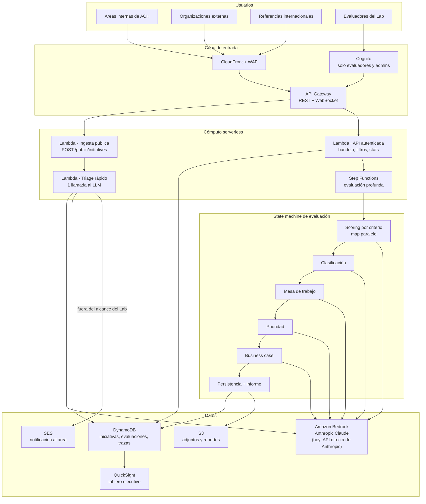

# Arquitectura de solución

## 1. Qué corre hoy y qué se propone para producción

El MVP demostrado usa un stack equivalente en Vercel / Render / Neon / Cloudinary por agilidad de desarrollo dentro del plazo del reto. El diseño AWS de esta página es el *path a producción*: cada pieza tiene un reemplazo directo y la frontera entre capas ya está trazada en el código (rutas → controladores → servicios → repositorios), de modo que la migración cambia adaptadores, no lógica de negocio.

**El modelo ya es el que pide el enunciado.** El MVP corre sobre Anthropic Claude, exactamente el mismo modelo que sirve Amazon Bedrock; lo consumimos por la API directa de Anthropic en lugar de por Bedrock. La migración es una línea: cambiar `new Anthropic(...)` por `new AnthropicBedrockMantle({ awsRegion })` en `llm.service.ts` y anteponer `anthropic.` al id del modelo (`anthropic.claude-opus-5`). El resto del archivo —y todo el código que lo llama— no cambia, porque el cliente de Bedrock expone la misma superficie `messages.create`.

| Capa | MVP actual | Target AWS | Por qué el reemplazo es directo |
| --- | --- | --- | --- |
| Modelo de lenguaje | Anthropic Claude vía API directa (`@anthropic-ai/sdk`) | **Amazon Bedrock** (mismo modelo, `AnthropicBedrockMantle`) | Todo el consumo del LLM pasa por `llm.service.ts` (`anthropic`, `generatePlainText`). Cambia el constructor del cliente y el prefijo del id; nada más. |
| Orquestación del pipeline pesado | `evaluation-pipeline.service.ts` (6 pasos secuenciales en un proceso) | **AWS Step Functions** | Cada paso ya es una función pura con entrada y salida serializable: scoring por criterio, clasificación, mesa, prioridad, business case, persistencia. |
| Cómputo y API | Express sobre Node | **AWS Lambda + Amazon API Gateway** | Los controladores no tocan `req`/`res` más allá del envelope; el router es la única pieza que cambia. |
| Base de datos | PostgreSQL (Neon) + Prisma | **Amazon DynamoDB** | Ver §4. Es el cambio de mayor esfuerzo: el modelo relacional debe rediseñarse por patrón de acceso. |
| Archivos adjuntos | Cloudinary | **Amazon S3** (+ CloudFront) | Aislado en `cloudinary.service.ts`; la app solo guarda `publicId` y `secureUrl`. |
| Identidad | JWT propio + refresh cookie HttpOnly | **Amazon Cognito** | El middleware `authenticate` resuelve un `req.user`; el verificador de token es lo único específico. |
| Notificación al área | SMTP genérico (Nodemailer) | **Amazon SES** | `notification.service.ts` expone `notifyWorkTable`; el transporte es un detalle interno. |
| Métricas ejecutivas | `GET /api/initiatives/stats` + dashboard propio | **Amazon QuickSight** sobre los datos | Deseable. El endpoint actual cubre el MVP; QuickSight cubre el consumo directivo. |

## 2. Diagrama de alto nivel (target AWS)

## 3. Los dos caminos, y por qué están separados

La decisión de arquitectura que sostiene la meta de «menos de 3 minutos» es **separar el triage del scoring**.

- **Camino rápido (todos los envíos).** Una Lambda, una llamada al LLM, respuesta síncrona en segundos. Es lo que ve quien envía la iniciativa. Decide categoría y mesa de trabajo, y si la iniciativa no es del Lab dispara la notificación al área dueña. No calcula scores ni redacta documentos.
- **Camino profundo (solo lo que se queda en el Lab).** Step Functions ejecuta el pipeline de seis pasos: scoring por criterio (paralelizable), clasificación, mesa, prioridad, business case y persistencia. Cuesta seis o más llamadas al modelo y minutos de reloj, y lo dispara un evaluador cuando decide profundizar.

Si ambos caminos fueran uno solo, cada bug report enviado por un área consumiría el presupuesto de razonamiento reservado para una iniciativa disruptiva, y nadie recibiría respuesta en tres minutos.

## 4. El cambio no trivial: PostgreSQL → DynamoDB

Es el único reemplazo que no es un adaptador. El modelo actual es relacional con seis entidades y varias relaciones; DynamoDB exige diseñar por patrón de acceso. Diseño propuesto de tabla única:

| Acceso requerido | PK | SK | Índice |
| --- | --- | --- | --- |
| Traer una iniciativa con contactos y adjuntos | `INITIATIVE#<id>` | `META` / `CONTACT#<id>` / `ATTACH#<id>` | — |
| Bandeja del Lab por estado y fecha | `STATUS#TRIAGED_LAB` | `<triagedAt>#<id>` | GSI1 |
| Listado global por canal de origen | `SOURCE#<sourceType>` | `<createdAt>#<id>` | GSI2 |
| Distribución por clasificación | `CLASSIFICATION#<id>` | `<triagedAt>#<id>` | GSI3 |
| Evaluaciones de una iniciativa | `INITIATIVE#<id>` | `EVAL#<createdAt>#<id>` | — |
| Conversación y mensajes de una evaluación | `EVAL#<id>` | `MSG#<createdAt>#<id>` | — |

Los agregados del dashboard (conteos por clasificación, por canal, serie de 30 días) no se resuelven con `Scan`: se mantienen como contadores incrementales en ítems `STATS#<periodo>` actualizados por la misma Lambda que escribe el triage, o se delegan a QuickSight sobre un export a S3. La búsqueda de texto libre del listado no tiene equivalente nativo y pasaría a OpenSearch Serverless.

## 5. Well-Architected

- **Seguridad.** Cognito para el back-office; el endpoint público es anónimo por diseño y se protege con WAF, rate limit por origen (hoy `express-rate-limit`, 10/hora) y validación estricta de esquema antes de tocar el LLM. Es stateless y no usa cookies, así que no tiene superficie CSRF. Secretos en Secrets Manager. Cifrado en reposo en DynamoDB y S3.
- **Fiabilidad.** El triage nunca descarta un envío: si el modelo falla, la iniciativa queda `REGISTERED` y un evaluador la clasifica a mano. Si el correo al área falla, el triage no se revierte —queda registrado sin `notificationSentAt`—. Step Functions aporta reintentos y catch por paso.
- **Eficiencia de rendimiento.** El scoring por criterio es un `Map` paralelo en la state machine. El camino rápido no espera al lento.
- **Optimización de costos.** Una llamada al LLM por envío en lugar de seis. Serverless puro: sin cómputo ocioso entre envíos.
- **Excelencia operativa.** IaC con AWS CDK; trazas por paso en la tabla de auditoría; X-Ray sobre la state machine.
- **Sostenibilidad.** Sin instancias permanentes; los adjuntos migran a S3 Intelligent-Tiering.
