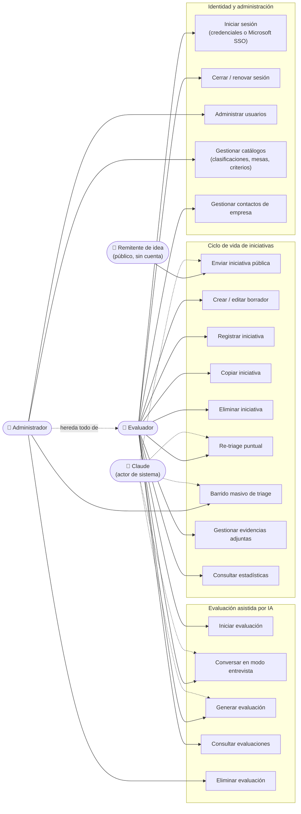
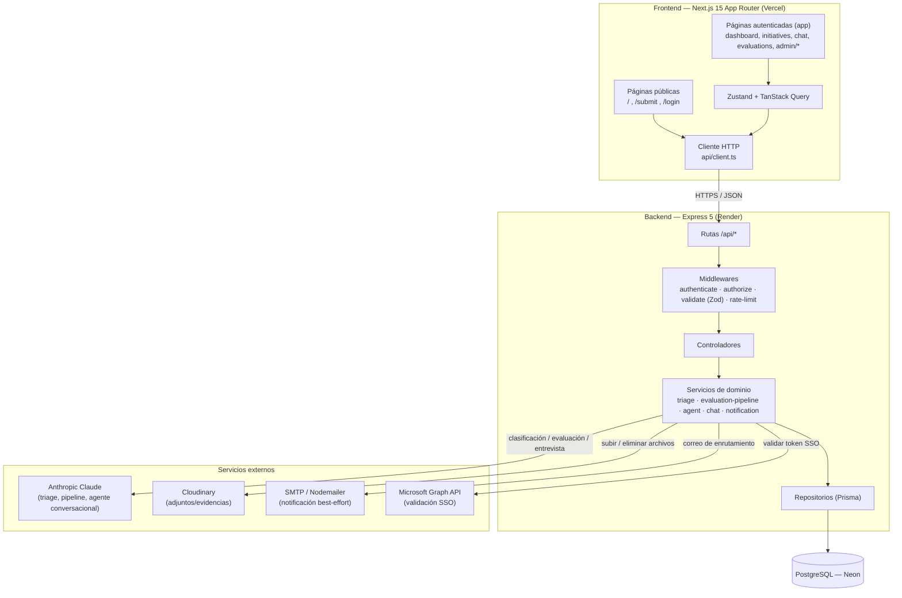
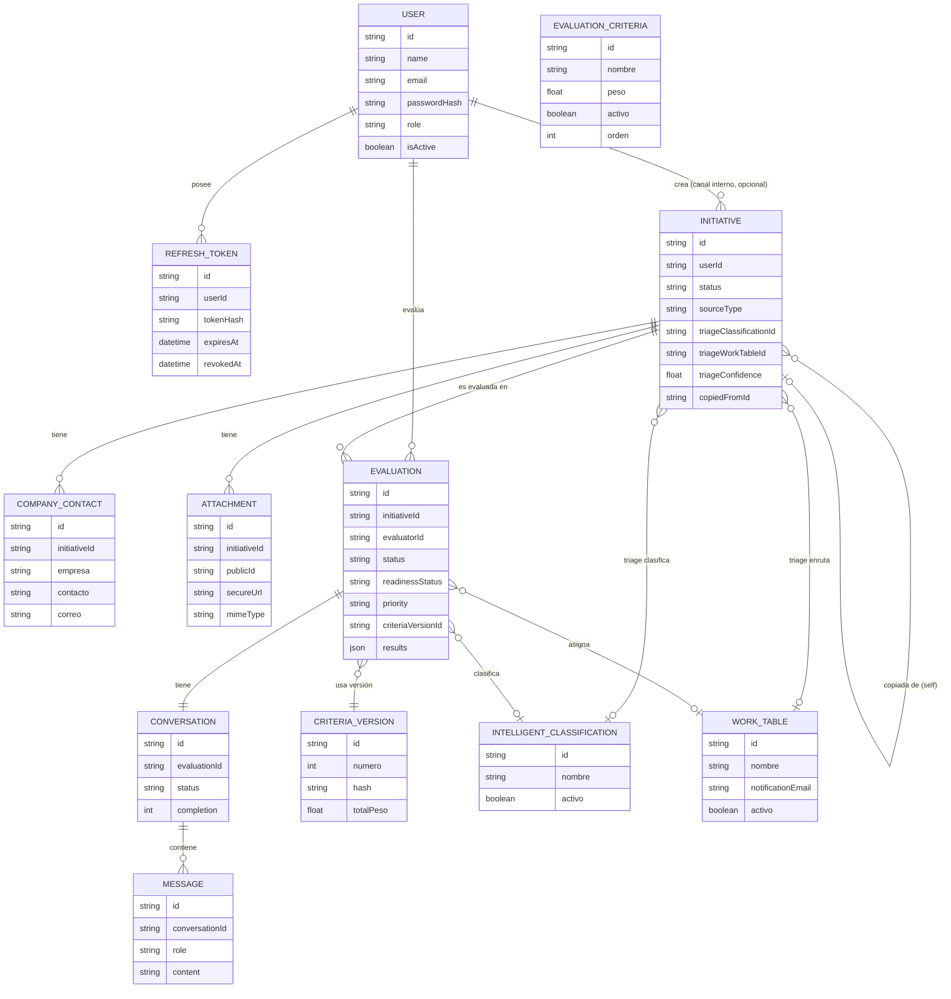
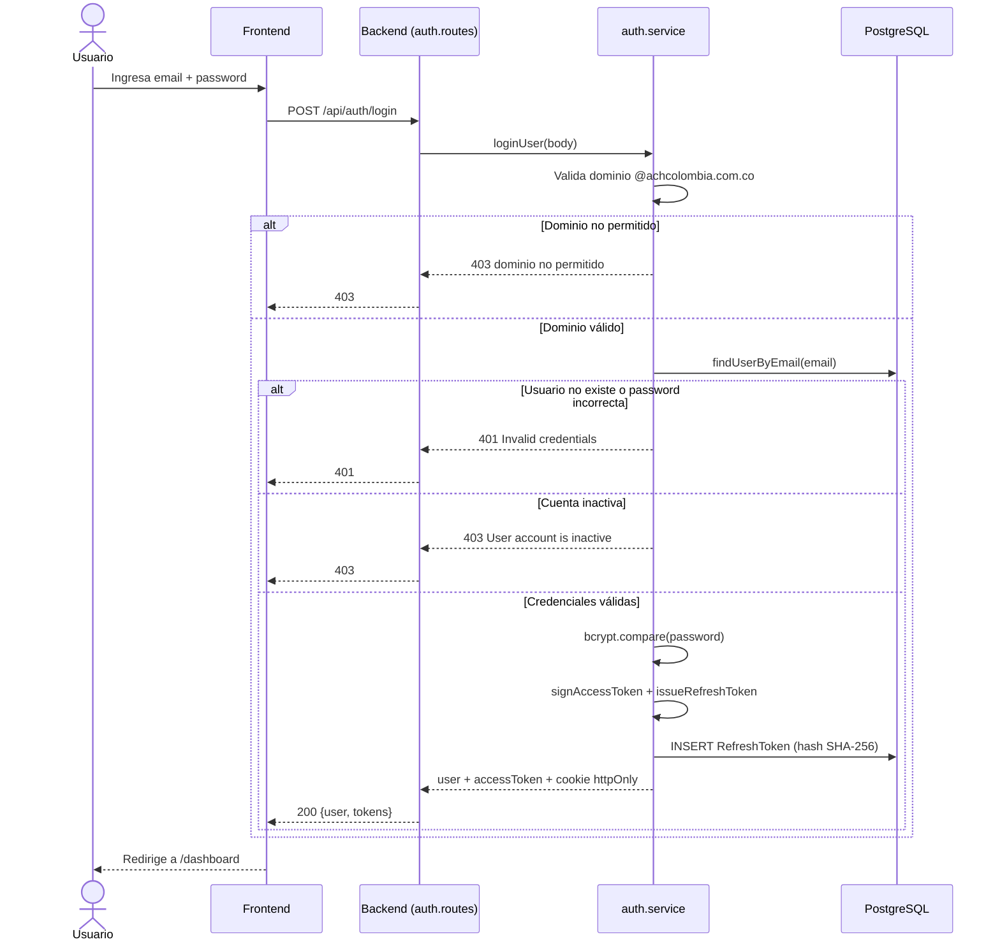
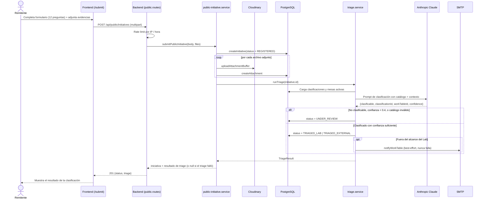
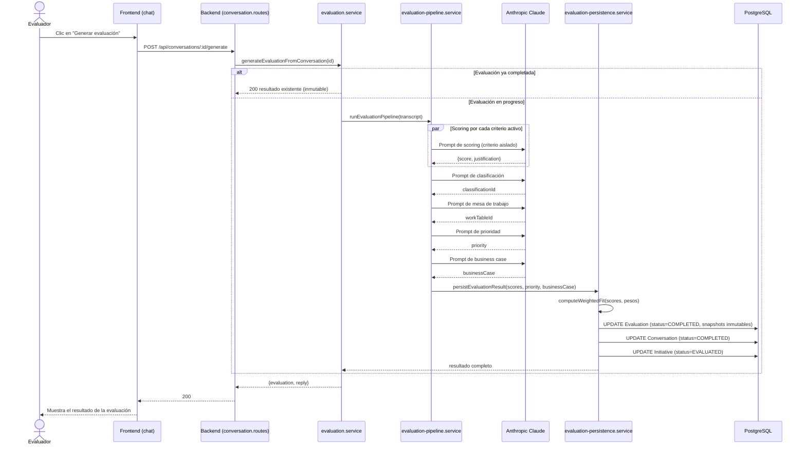

# Diagramas de apoyo — LabLens

**Fecha:** 2026-08-13
**Formato:** código [Mermaid](https://mermaid.js.org/) embebido en bloques ```` ```mermaid ```` — es texto plano (editable como descripción) que además se renderiza como diagrama real en GitHub, VS Code, Pandoc y la mayoría de conversores a PDF con soporte Mermaid. Todo el contenido es trazable 1:1 a `docs/actores-sistema.md`, `docs/casos-de-uso.md` e `docs/inventario-tecnico.md`.

---

## 1. Diagrama de casos de uso (UML)

Mermaid no tiene un tipo nativo de "diagrama de casos de uso"; se modela como un `flowchart` con los actores primarios conectados a sus casos de uso, agrupados por dominio funcional. El actor "Claude" se incluye como actor de sistema (no humano) en los casos de uso donde interviene directamente.



**Nota:** el rol `ADMIN` incluye todas las capacidades de `EVALUATOR` (flecha "hereda todo de") más las exclusivas mostradas arriba. `CompanyContact` no aparece como actor porque es un dato, no un actor (ver `docs/actores-sistema.md`).

---

## 2. Diagrama de arquitectura AS-IS

Capas, componentes principales y dirección real del flujo de datos, según el código actual (sin el roadmap AWS, que es solo diseño futuro).



**Notas del AS-IS:** monolito de dos procesos independientes (sin descomposición en microservicios); sin colas asíncronas — las llamadas a Claude ocurren dentro de la misma petición HTTP; sin caché de base de datos ni CDN propio (más allá de lo que Vercel/Render den por defecto). Detalle completo en `docs/requisitos-no-funcionales.md`.

---

## 3. Diagrama entidad-relación

Basado en `backend/prisma/schema.prisma`, con las 12 entidades documentadas en `docs/inventario-tecnico.md` (sección 2).



**Nota:** `EvaluationCriteria` es el catálogo editable de criterios; `CriteriaVersion` es el snapshot inmutable que cada `Evaluation` referencia para auditoría (ver RF-20/RF-59 en `docs/requisitos-funcionales.md`).

---

## 4. Diagramas de secuencia — flujos críticos

Se eligieron los 3 flujos de mayor riesgo/complejidad del sistema.

### 4.1 Login con credenciales



### 4.2 Envío público de iniciativa + triage automático con IA



### 4.3 Generar evaluación desde la conversación (pipeline de IA)


