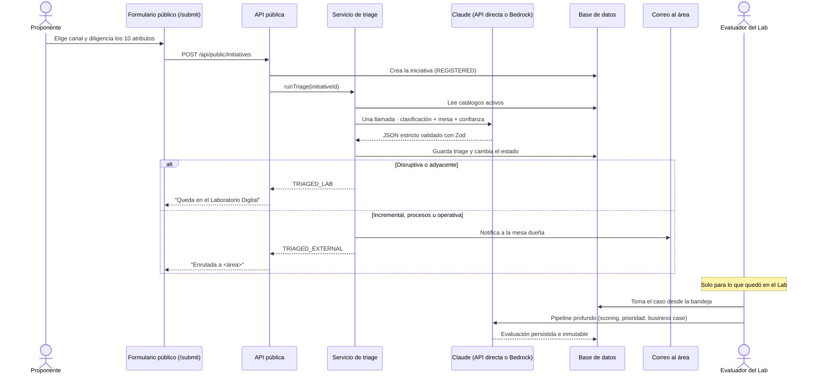
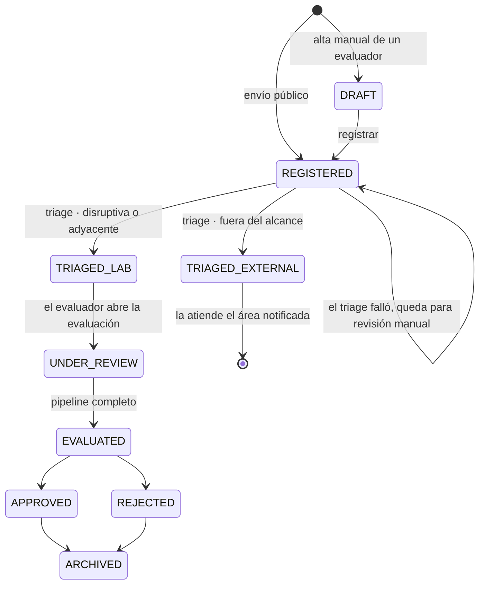

# Flujo operativo

## 1. Del envío al dictamen

## 2. Estados de una iniciativa

## 3. Dónde decide la IA y dónde decide la lógica de negocio

Esta separación es deliberada: el modelo razona y redacta, pero no calcula el número que ordena el portafolio.

| Decisión | Quién la toma | Cómo se controla |
| --- | --- | --- |
| Categoría de la taxonomía | LLM | Debe elegir un UUID del catálogo activo; se valida contra la base antes de persistir. |
| Mesa de trabajo | LLM | Igual: UUID del catálogo, validado. El prompt fija la coherencia categoría ↔ mesa. |
| Confianza del triage | LLM | Número 0–1 con bandas descritas en el prompt; se muestra al evaluador, nunca decide sola. |
| ¿Es alcance del Lab? | **Lógica de negocio** | `LAB_SCOPE_CLASSIFICATIONS` en `triage.service.ts`. El modelo no responde este campo. |
| Score por criterio (0–100) | LLM, un criterio a la vez | Cada criterio se puntúa aislado, para que un criterio no contamine al otro. |
| **Fit final (0–100)** | **Lógica de negocio** | Promedio ponderado con los pesos vigentes, calculado en `fit.service.ts`. El modelo nunca lo inventa. |
| Pesos de los criterios | **Configuración** | Tabla `EvaluationCriteria`, editable por un admin; deben sumar 100. |
| Business case | LLM | Estructura fija de seis secciones validada con Zod. |

## 4. Trazabilidad

Cada evaluación guarda `criteriaSnapshot`, `weightsSnapshot` y `configVersion`. Si mañana un admin cambia los pesos, las evaluaciones anteriores siguen explicándose con la configuración que tenían el día que se generaron. Eso es lo que hace auditable el dictamen: no basta con el número, hace falta la regla que lo produjo.

En el triage, la traza equivalente son `triageReasoning`, `triageConfidence`, `triagedAt` y `notificationSentAt` sobre la propia iniciativa.
