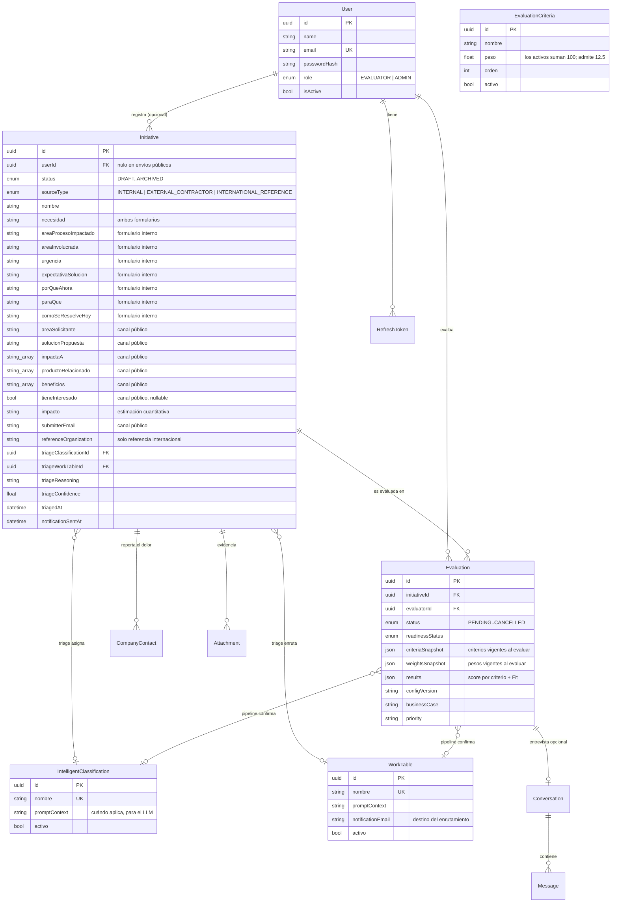

# Modelo de datos

Refleja `backend/prisma/schema.prisma` después de la última migración aplicada, `20260811000000_criteria_decimal_weights`.

Las tres migraciones que dejaron el modelo en su forma actual:

| Migración | Qué cambió |
| --- | --- |
| `20260806200000_public_form_v2` | Añadió a `Initiative` los campos del formulario público de 11 preguntas |
| `20260806230000_multi_select_scope` | Convirtió `impactaA`, `productoRelacionado` y `beneficios` de `TEXT` a `TEXT[]` |
| `20260811000000_criteria_decimal_weights` | `EvaluationCriteria.peso` de `INTEGER` a `DOUBLE PRECISION` |

## 1. Diagrama entidad-relación



## 2. Decisiones del modelo que no son obvias

**`Initiative.userId` es nulo.** El canal público no crea cuentas. La iniciativa existe sin usuario y la trazabilidad de quién la envió vive en `submitterName` / `submitterEmail` más los `CompanyContact`. La relación con `User` es `onDelete: SetNull`: borrar un evaluador no borra el histórico del portafolio.

**El triage vive en `Initiative`, no en `Evaluation`.** Son dos cosas distintas. El triage es un dictamen barato que toda iniciativa recibe una vez; la evaluación es un expediente caro que solo existe para lo que se queda en el Lab, y puede repetirse. Meterlos en la misma tabla obligaría a crear una `Evaluation` vacía por cada bug report que llega.

**Los catálogos son datos, no enums.** Clasificaciones, mesas de trabajo y criterios son tablas editables desde el panel de administración, con un `promptContext` que se inyecta en el prompt. Cambiar la taxonomía corporativa no requiere desplegar código.

**Las evaluaciones guardan snapshots.** `criteriaSnapshot`, `weightsSnapshot` y `configVersion` congelan la configuración usada. Sin eso, cambiar un peso reescribiría retroactivamente el sentido de todos los dictámenes anteriores.

## 3. Catálogos sembrados

Los seis criterios corresponden a la sección 5.3 del enunciado, con sus pesos declarados exactos.

| Criterio | Peso |
| --- | --- |
| Alineación estratégica | 20 |
| Nivel de innovación | 20 |
| Valor para el negocio | 20 |
| Impacto al cliente | 15 |
| Escalabilidad | 12,5 |
| Factibilidad técnica | 12,5 |

El `promptContext` de estos criterios incorpora además las definiciones y preguntas orientadoras de la **sección 9.1** (criterios de valor de ACH). Esa sección detalla cómo entender el valor, no reemplaza el modelo de scoring: sus cinco criterios se reparten entre estos seis — potencial de ingresos, protección del negocio y diversificación caen en *Valor para el negocio*; experiencia del cliente en *Impacto al cliente*; tamaño de mercado en *Escalabilidad*. Puntuar diez dimensiones solapadas diluiría el score sin agregar criterio.

| Clasificación | ¿Se queda en el Lab? | Mesa por defecto |
| --- | --- | --- |
| Innovación disruptiva | Sí | Laboratorio Digital |
| Innovación adyacente | Sí | Laboratorio Digital |
| Mejora incremental | No | Producto / Operaciones & TI |
| Mejora de procesos | No | Procesos |
| Solicitud operativa | No | Producto / Operaciones & TI |

Las iniciativas puramente de gobierno de datos o ciberseguridad se enrutan a **Seguridad / Data & Analytics** con independencia de su categoría.

## 4. Esquemas JSON de la solución

`Evaluation.results` (calculado por la lógica de negocio, no por el modelo):

```json
{
  "criteriaScores": [
    { "criteriaId": "uuid", "nombre": "Alineación estratégica", "peso": 20, "score": 78, "justification": "…" },
    { "criteriaId": "uuid", "nombre": "Escalabilidad", "peso": 12.5, "score": 60, "justification": "…" }
  ],
  "fit": 74,
  "priority": "Alta",
  "priorityJustification": "…",
  "classificationJustification": "…",
  "workTableJustification": "…",
  "triageComparison": {
    "huboTriage": true,
    "clasificacionCoincide": true,
    "mesaCoincide": false,
    "triageClassificationNombre": "Innovación adyacente",
    "triageWorkTableNombre": "Laboratorio Digital",
    "triageConfidence": 0.87
  }
}
```

**Sobre `triageComparison`.** Registra si el dictamen profundo coincidió con el filtro rápido. No se le muestra al modelo durante la evaluación: inyectar el veredicto del triage en su contexto lo anclaría a coincidir, y se perdería lo único que hace útil el contraste — que son dos opiniones independientes sobre el mismo caso. Acumulado sobre las iniciativas evaluadas, es la medición de la precisión del filtro que exige la sección 3 del enunciado (95%), sin necesidad de construir a mano un set etiquetado.

Los campos `clasificacionCoincide` y `mesaCoincide` son `null`, no `false`, cuando el triage mandó la iniciativa a revisión manual en lugar de arriesgar una clasificación. Contar eso como error castigaría justo la conducta prudente. `huboTriage` es `false` para las iniciativas del formulario interno, que hoy no pasan por triage.

`Evaluation.businessCase` (redactado por el modelo, estructura validada):

```json
{
  "resumenEjecutivo": "…",
  "objetivosNegocio": ["…"],
  "beneficiosEstimados": ["…"],
  "riesgosPrincipales": ["…"],
  "kpisSugeridos": ["…"],
  "recomendacionFinal": "…"
}
```
