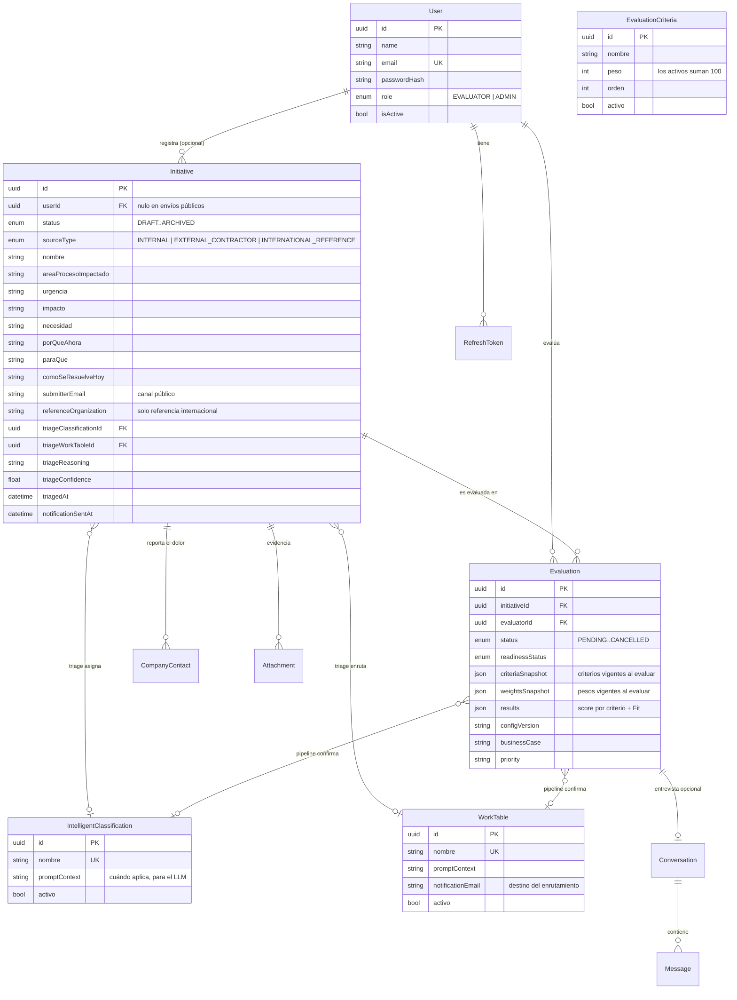

# Modelo de datos

Refleja `backend/prisma/schema.prisma` después de las migraciones `20260805000000_source_type_and_triage` y `20260806000000_remove_generator_role`.

## 1. Diagrama entidad-relación



## 2. Decisiones del modelo que no son obvias

**`Initiative.userId` es nulo.** El canal público no crea cuentas. La iniciativa existe sin usuario y la trazabilidad de quién la envió vive en `submitterName` / `submitterEmail` más los `CompanyContact`. La relación con `User` es `onDelete: SetNull`: borrar un evaluador no borra el histórico del portafolio.

**El triage vive en `Initiative`, no en `Evaluation`.** Son dos cosas distintas. El triage es un dictamen barato que toda iniciativa recibe una vez; la evaluación es un expediente caro que solo existe para lo que se queda en el Lab, y puede repetirse. Meterlos en la misma tabla obligaría a crear una `Evaluation` vacía por cada bug report que llega.

**Los catálogos son datos, no enums.** Clasificaciones, mesas de trabajo y criterios son tablas editables desde el panel de administración, con un `promptContext` que se inyecta en el prompt. Cambiar la taxonomía corporativa no requiere desplegar código.

**Las evaluaciones guardan snapshots.** `criteriaSnapshot`, `weightsSnapshot` y `configVersion` congelan la configuración usada. Sin eso, cambiar un peso reescribiría retroactivamente el sentido de todos los dictámenes anteriores.

## 3. Catálogos sembrados

Los seis criterios corresponden a la sección 5.3 del enunciado. Los pesos declarados son 20 / 20 / 20 / 15 / 12,5 / 12,5; como el campo es entero, el 12,5 se reparte en 13 (Escalabilidad) y 12 (Factibilidad técnica) para sumar 100.

| Criterio | Peso |
| --- | --- |
| Alineación estratégica | 20 |
| Nivel de innovación | 20 |
| Valor para el negocio | 20 |
| Impacto al cliente | 15 |
| Escalabilidad | 13 |
| Factibilidad técnica | 12 |

| Clasificación | ¿Se queda en el Lab? | Mesa por defecto |
| --- | --- | --- |
| Innovación disruptiva | Sí | Laboratorio Digital |
| Innovación adyacente | Sí | Laboratorio Digital |
| Mejora incremental | No | Producto / Operaciones & TI |
| Mejora de procesos | No | Procesos |
| Solicitud operativa | No | Producto / Operaciones & TI |

Las iniciativas puramente de gobierno de datos o ciberseguridad se enrutan a **Seguridad / Data & Analytics** con independencia de su categoría.

## 4. Esquemas JSON de la solución

`Evaluation.results` (calculado por la lógica de negocio, no por el modelo):

```json
{
  "criteriaScores": [
    { "criteriaId": "uuid", "nombre": "Alineación estratégica", "peso": 20, "score": 78, "justification": "…" }
  ],
  "fit": 74,
  "priority": "Alta"
}
```

`Evaluation.businessCase` (redactado por el modelo, estructura validada):

```json
{
  "resumenEjecutivo": "…",
  "objetivosNegocio": ["…"],
  "beneficiosEstimados": ["…"],
  "riesgosPrincipales": ["…"],
  "kpisSugeridos": ["…"],
  "recomendacionFinal": "…"
}
```
